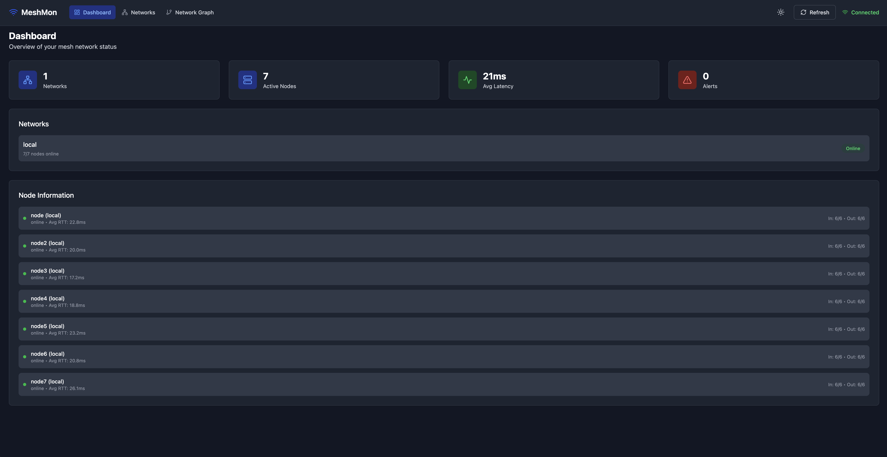
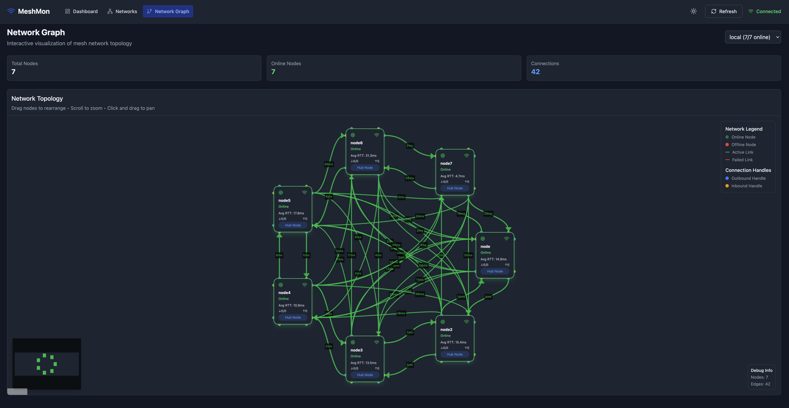
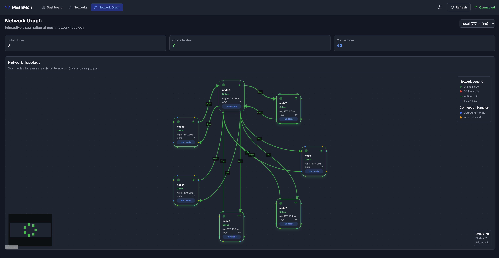
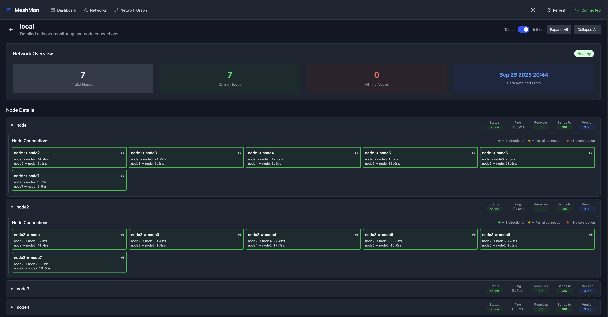

# meshmon

  <strong>Distributed peer-to-peer monitoring system with cryptographic security</strong>

  
  
  

---

## Introduction

**meshmon** is a distributed monitoring system designed to create resilient networks of nodes that monitor each other's health and status. It provides secure, scalable, and extensible peer-to-peer monitoring with built-in cryptographic verification and flexible configuration management.

### Key Benefits

- **Secure**: Ed25519 cryptographic signing ensures data authenticity
- **Mesh Architecture**: No single point of failure - nodes monitor each other
- **Flexible**: Support for local and remote Git-based configurations

### docs

Checkout the [docs](https://meshmon.ripplefcl.com)

## Screenshots

### Dashboard Overview

  

### Network Graph Visualization

  

### Individual Node Details

  

### Networks Management

  

