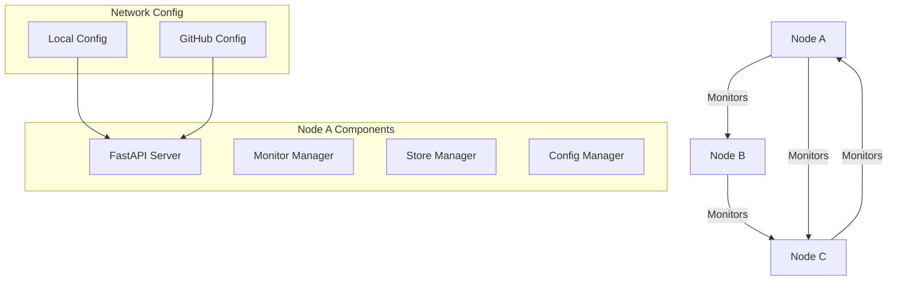
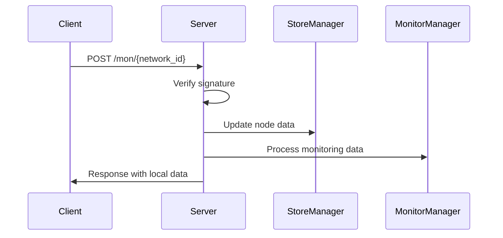
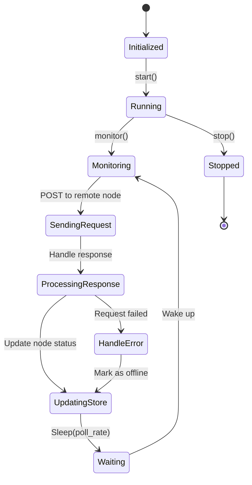
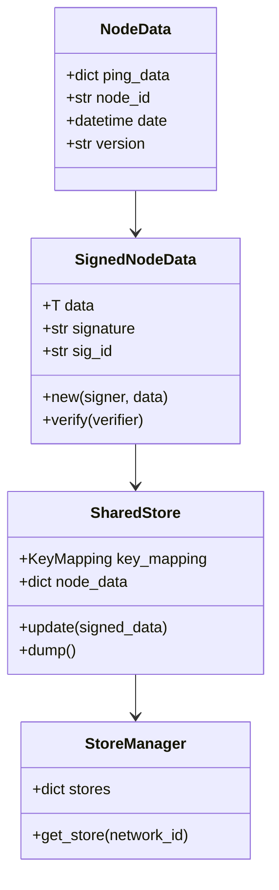
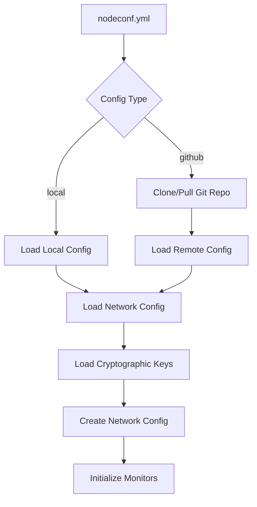
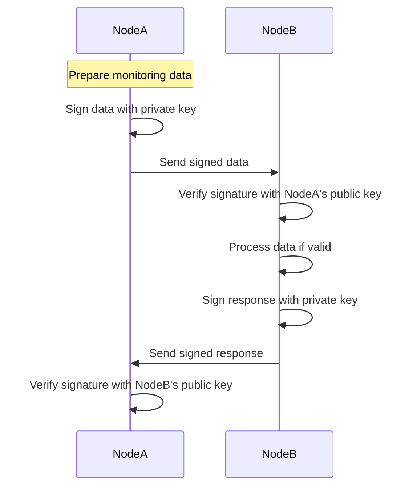
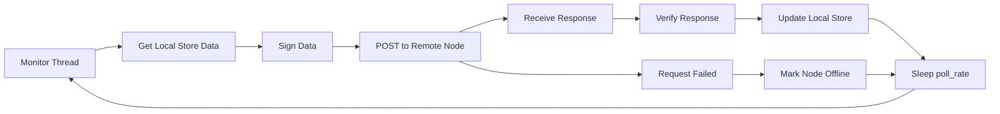

# distomon Code Architecture

This document explains the architecture and code structure of distomon, a distributed monitoring solution.

## System Overview

distomon is a distributed monitoring system where nodes monitor each other's health and status. Each node runs a FastAPI server that communicates with other nodes in the network using cryptographically signed messages.



## Core Components

### 1. Server (`server.py`)

The main FastAPI application that handles HTTP requests and coordinates all other components.

**Key responsibilities:**
- Initialize managers (Store, Monitor, Config)
- Handle authentication (JWT and Basic Auth)
- Provide API endpoints for monitoring data exchange
- Manage environment configuration



### 2. Monitor Manager (`monitor.py`)

Manages monitoring threads that periodically check the health of remote nodes.

**Key components:**
- `Monitor`: Individual monitoring thread for a specific remote node
- `MonitorManager`: Coordinates all monitoring threads across networks



**Monitor workflow:**
1. Load store data and sign it
2. Send POST request to remote node's `/mon/{network_id}` endpoint
3. Process response and update local store with remote node's status
4. Handle errors and mark nodes offline if unreachable
5. Sleep for `poll_rate` seconds and repeat

### 3. Store Manager (`distrostore.py`)

Manages distributed storage of node data across different networks.

**Key classes:**
- `NodeData`: Contains ping data, node ID, timestamp, and version
- `SignedNodeData`: Cryptographically signed node data
- `SharedStore`: In-memory storage for a single network
- `StoreManager`: Manages multiple stores across networks



### 4. Configuration Manager (`config.py`)

Handles loading and managing network configurations from local files or GitHub repositories.

**Key features:**
- Support for local and GitHub-based configurations
- Automatic Git repository cloning/pulling
- Cryptographic key management
- Network topology definition



**Configuration structure:**
```yaml
networks:
  - name: test
    node_id: seeg
    config_type: github
    git_repo: https://github.com/rippleFCL/distmon-test.git
login_password: password
```

### 5. Cryptographic System (`crypto.py`)

Provides Ed25519 signing and verification for secure message exchange.

**Key classes:**
- `Signer`: Signs outgoing messages
- `Verifier`: Verifies incoming messages
- `KeyMapping`: Maps node IDs to their cryptographic keys



## Data Flow

### Monitoring Cycle



### API Endpoints

The server exposes several endpoints:

- `POST /mon/{network_id}`: Exchange monitoring data between nodes
- `GET /store/{network_id}`: Retrieve current store data
- `POST /login`: Authenticate and get JWT token
- `GET /info`: Get node information

### Error Handling

The system includes comprehensive error handling:

1. **Network errors**: Nodes marked offline after retry limit exceeded
2. **Signature verification**: Invalid signatures rejected
3. **Configuration errors**: Graceful fallbacks and logging
4. **Threading**: Daemon threads prevent hanging on shutdown

## Security Model

1. **Cryptographic Signing**: All inter-node communication is signed with Ed25519
2. **Authentication**: API endpoints protected with JWT tokens
3. **Key Management**: Public keys stored per network, private keys local only
4. **Signature Verification**: All incoming data verified before processing

This architecture provides a robust, secure, and scalable distributed monitoring solution that can adapt to various network topologies and requirements.
